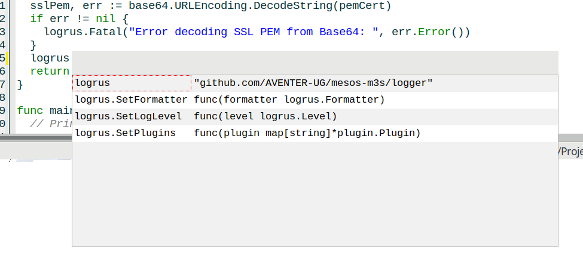

# MiniEdit - Simple Editor for Development

## Features

- Tabbed editor
- Syntax highligthing for 61 languages/file formats
- Undo/Redo support
- Tools for text editing (change line endings, native XML/JSON/SQL beautifier, sort, change case and so on)
- Support for various encoding (UTF-8, UCS2, ISO-8859-1, ecc.)
- Print with syntax highligthing
- Run 'Make' with realtime output into CMD Box.
- Open File in a Hexeditor
- Shortcut Support
- LSP Support for code complition (currently only for golang and python).
- Bookmark Project Folders
- Paste Images from Clipboard (only works with BMP data).
- Simple Preview for Markdown files.

## LSP

There is no "one fix all" LSP Server. That means, for every programming
language, you have to install it's own LSP Server. 😔 Currently, MiniEdit
does support only LSP for Golang via `gopls`. Be sure that it is installed
and in one of your PATH directories therefore MiniEdit can find it.

- ALT+. (PERIOD) will open the LSP window for code completion. But only if the
LSP Server could find any information.
- ALT+- (MINUS) - on a package name (as example `import "fmt"`) will open the
LSP window with a description to these package. But again, only if the LSP
Server could find any information about that.

## Features in planing

- Connection with Ollama AI 🤷

## Requirements

- [libqt6pas.so/dll](https://github.com/davidbannon/libqt6pas/releases)

## How to compile

- Install Lazarus 3.6
- TRichMemo, TSynEdit, CmdBox, fpc-markdown

## Shortcuts

- F3 - Search the selected text and/or find next
- SHIFT+F3 - Find previous
- F4 - View File in Hex Editor
- F5 - Go to line
- F9 - Run Make
- (SHIFT)+TAB - Jump between FileTree and Editor
- ALT+0 .. ALT+1 - Select Editor Tab 1 to 10
- ALT+Right/Left - Move selected Editor Tab
- ALT+. (PERIOD) - Show LSP window for code completion
- ALT+- (MINUS) - Show LSP window for package information
- CTRL+F - Search
- CTRL+R - Replease
- CTRL+Z - Undo
- CTRL+N - New File
- CTRL+O - Open File
- CTRL+S - Save File
- CTRL+F4 - Close File
- CTRL+Q - Exit without to ask
- SHIFT+CTRL+Z - Redo
- SHIFT+ALT-UP/DOWN/RIGHT/LEFT - Block Selection

## Thanks

- MiniEdit is based on ovotext from [Marco Caselli](https://github.com/varianus/ovotext/). It was a perfect "template" to create
my own Dev-Editor with all the features I need and all the shortcuts my fingers like to have. :-) Thanks to you Marco.
- My own Syntax highligthing files are using [SynFacilBasic](https://github.com/t-edson/SynFacilSyn) from Por Tito Hinostroza.
It's a great way to create own Syntax highligthing files for SynEdit. So, also many thanks to him.

## 3rdParty Licenses

- Some of the glyphs are provided by https://figma.com/glyphs.fyi under [CC BY 4.0](https://creativecommons.org/licenses/by/4.0/)
- The FileType Icons are provided by https://github.com/uiwjs/file-icons under [MIT License](https://opensource.org/licenses/MIT)
- The Syntax Highlighting modules provided by SynEdit are under [Mozilla MPL](http://www.mozilla.org/MPL/)
- The Syntax Highlighting modules provided by PiNote are under GPL.

## Screenshot

