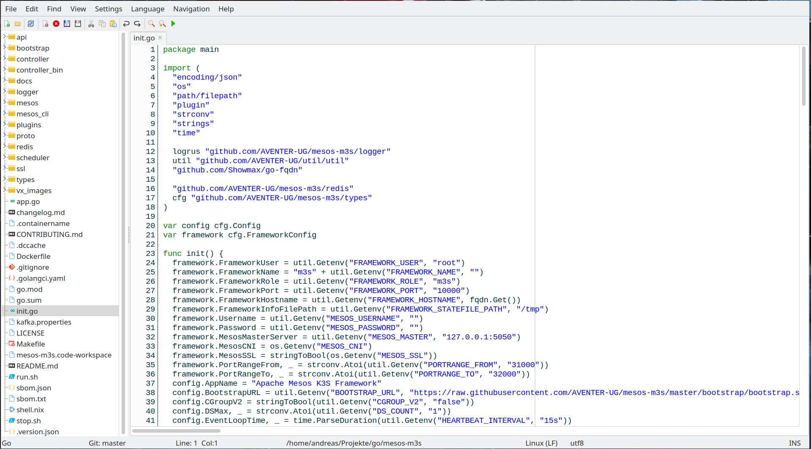

# MiniEdit - Simple Editor for Development

MiniEdit is based on ovotext from [Marco Caselli](https://github.com/varianus/ovotext/). It was a perfect "template" to create
my own Dev-Editor with all the features I need and all the shortcuts my fingers like to have. Thanks to you Marco. :-)

## Features

- Tabbed editor
- Syntax highligthing for a lot of programming languages and file formats
- Export formatted text to RTF or HTML file/clipboard
- Undo/Redo support
- Tools for text editing (change line endings, native XML/JSON/SQL beautifier, sort, change case and so on)
- Support for various encoding (UTF-8, UCS2, ISO-8859-1, ecc.)
- Print with syntax highligthing
- Run 'Make' with realtime output into CMD Box.
- ShortCut Support

## How to compile

- Install Lazarus 3.6

## Screenshot

